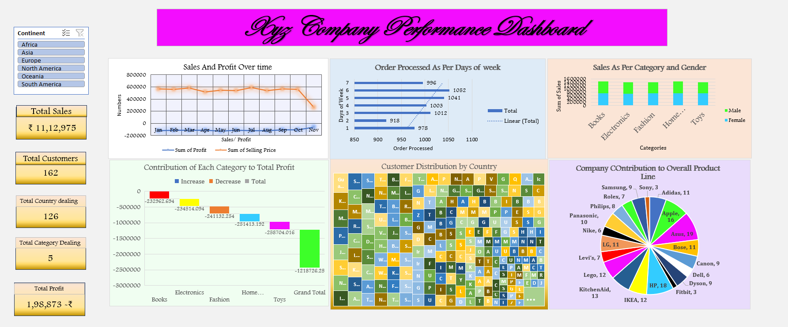

# 📊 Data Analytics Dashboards (Excel & Power BI)

## 📌 Project Overview

**This repository showcases interactive data analytics dashboards developed using Microsoft Excel and Power BI as part of my Data Analytics Internship at Grras IT Solutions.
The project focuses on transforming raw datasets into insightful and interactive visual dashboards that help analyze business performance and global socio-economic indicators.**

# 📈 Excel Dashboard – Company Performance Analysis

## Dashboard Objective
* Preview 

  

The Excel dashboard analyzes company sales performance across different dimensions such as time, categories, customers, and geography.

## Key Metrics (KPI Cards)

The dashboard highlights important business indicators:

* Total Sales
* Total Customers
* Total Countries Dealing
* Total Categories Dealing
* Total Profit

These KPIs provide a quick snapshot of business performance.

---

## Visualizations Included

### 1️⃣ Sales & Profit Over Time

A **line chart** showing the trend of sales and profit across months.

Purpose:

* Identify seasonal trends
* Understand sales growth patterns

---

### 2️⃣ Orders Processed by Day of Week

A **horizontal bar chart** showing which days receive the most orders.

Insight:
Helps understand peak business activity days.

---

### 3️⃣ Sales by Category and Gender

A **stacked column chart** comparing male and female customer purchases across categories.

Categories include:

* Books
* Electronics
* Fashion
* Home
* Toys

---

### 4️⃣ Customer Distribution by Country

A **Treemap visualization** representing customer concentration across countries.

Purpose:

* Identify high-customer regions
* Understand geographic reach.

---

### 5️⃣ Contribution of Each Category to Total Profit

A **Waterfall Chart** showing how each category contributes positively or negatively to overall profit.

---

### 6️⃣ Company Contribution to Product Line

A **Pie Chart** displaying the share of different companies within the product ecosystem.

Examples:

* Apple
* Samsung
* Sony
* LG
* Adidas
* Bose

---

### 7️⃣ Continent Filter (Interactive Slicer)

The dashboard includes a **continent slicer** allowing users to filter the entire dashboard dynamically.

Supported continents:

* Africa
* Asia
* Europe
* North America
* Oceania
* South America

All charts automatically update based on the selected continent.

---

# 🌍 Power BI Dashboard – World Indicators Analysis

## Dashboard Objective
* Preview 

  

The Power BI dashboard analyzes **global socio-economic indicators** to understand relationships between economic growth, health investment, technology adoption, and poverty reduction.

---

## Key Metrics

The dashboard highlights:

* Average GDP per Capita
* Average Trade Value
* Health Expenditure (% of GDP)
* GDP Growth Rate
* Percentage of Land Under Forest

These indicators provide a high-level view of economic and environmental development.

---

## Visualizations Included

### 1️⃣ Health Expenditure by Region

A **bar chart** comparing average health expenditure across world regions.

Insight:
Highlights regional differences in healthcare investment.

---

### 2️⃣ Socio-Economic Indicators Over Time

A **multi-line trend chart** tracking indicators such as:

* Internet subscriptions
* Renewable energy use
* Immunization rates
* Unemployment
* GDP indicators

This visualization helps analyze development trends over time.

---

### 3️⃣ Internet Penetration vs Immunization

A **scatter plot** analyzing whether increased internet access correlates with improved immunization awareness.

---

### 4️⃣ Internet Penetration vs Unemployment

A **scatter plot with trend line** to investigate if higher internet access impacts unemployment levels.

---

### 5️⃣ Top 10 Countries in Poverty Reduction

A **bar chart** showing countries that achieved the highest reduction in poverty levels.

---

### 6️⃣ Bottom 10 Countries in Poverty Reduction

A **bar chart** identifying countries struggling with poverty reduction.

---

### 7️⃣ Correlation of Health Indicators

A **heatmap matrix** showing correlations between:

* Health expenditure
* Life expectancy
* Immunization
* Disease indicators

---

# 🛠 Tools Used

* **Microsoft Excel**
* **Power BI**
* Data Visualization Techniques
* Pivot Tables
* DAX Measures
* Interactive Filters & Slicers

---

# 📊 Skills Demonstrated

* Data Cleaning
* Data Visualization
* Dashboard Design
* Business Analytics
* Power BI DAX
* Interactive Reporting

---
# 👨‍💻 Author

**Ashwin Yadav**  
M.Sc. IT – Data Management, Analytics & Visual Insight  
Gujarat University  

📌 Project developed during **Data Analytics Internship at Grras IT Solutions**
---

⭐ If you found this project useful, feel free to give it a star.

